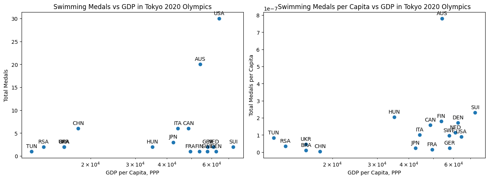
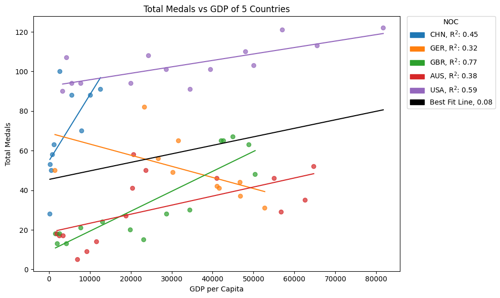

How does a country's GDP correlate with its success in winning Olympic medals? Can we identify trends to suggest the influence of economic resources on Olympic performance, and to what extent can we use GDP to predict Olympic medal outcomes?

## The Data:

I grabbed Gross Domestic Product (GDP) data from the World Bank Group. The Purchasing Power Parity (PPP) dataset is better for cross country comparisons since it converts the data into international currency, but the GDP per capita dataset has a larger time coverage, so I grabbed both.
* [GDP Per Capita](https://data.worldbank.org/indicator/NY.GDP.PCAP.CD)
* [GDP Per Capita, PPP](https://data.worldbank.org/indicator/NY.GDP.PCAP.PP.CD)

I grabbed Olympic Medals data from Kaggle here:
* [Summer Olympics Medals](https://www.kaggle.com/datasets/stefanydeoliveira/summer-olympics-medals-1896-2024/data)


```
# Download olympics dataset from kaggle
!kaggle datasets download -d stefanydeoliveira/summer-olympics-medals-1896-2024

# Unzip the dataset
!unzip summer-olympics-medals-1896-2024.zip

# GDP Dataset URLs
gdp_pc_url = 'https://api.worldbank.org/v2/en/indicator/NY.GDP.PCAP.CD?downloadformat=excel'
gdp_pc_ppp_url = 'https://api.worldbank.org/v2/en/indicator/NY.GDP.PCAP.PP.CD?downloadformat=excel'

# Name the GDP files
gdp_pc_excel_file_name = 'gdp_pc_data.xlsx'
gdp_pc_ppp_excel_file_name = 'gdp_pc_ppp_data.xlsx'

# Population Data
pop_url = 'https://api.worldbank.org/v2/en/indicator/SP.POP.TOTL?downloadformat=excel'
pop_excel_file_name = 'population_data.xlsx'

# Download and Save the files
!wget -O {gdp_pc_excel_file_name} {gdp_pc_url}
!wget -O {gdp_pc_ppp_excel_file_name} {gdp_pc_ppp_url}
!wget -O {pop_excel_file_name} {pop_url}
```

Import all the packages.


```python
# Dataset managment
import pandas as pd
import numpy as np

# Visualizations
import matplotlib.pyplot as plt
from matplotlib import colormaps
import matplotlib.colors as mcolors
import matplotlib.patches as mpatches

import plotly.express as px
import plotly.graph_objects as go

# Statistical Analysis
from scipy import stats
```

I converted each `.csv` file into a pandas dataframe so I could manipulate the data.


```python
# Read csv files into dataframes with pandas
olympics = pd.read_csv('olympics_dataset.csv')
gdp_pcs = pd.read_excel(gdp_pc_excel_file_name, skiprows=3)
gdp_pc_ppps = pd.read_excel(gdp_pc_ppp_excel_file_name, skiprows=3)
pops = pd.read_excel(pop_excel_file_name, skiprows=3)

# Cleaning data
olympics = olympics.drop(['player_id', 'Season'], axis=1)

# Find all of the olympic teams and their corresponding NOC's
olympic_teams = olympics[olympics['Year'] == 2020][['Team', 'NOC']]
olympic_teams = olympic_teams.drop_duplicates(['Team', 'NOC'])

# Match GDP data with olympic NOC's
gdp_pc_ppp = gdp_pc_ppps.drop(['Country Code', 'Indicator Name', 'Indicator Code'], axis=1)
gdp_pc_ppp = gdp_pc_ppp.rename(columns={'Country Name': 'Team'})

gdp_pc = gdp_pcs.drop(['Country Code', 'Indicator Name', 'Indicator Code'], axis=1)
gdp_pc = gdp_pc.rename(columns={'Country Name': 'Team'})
gdp_pc = gdp_pc.replace(to_replace='United Kingdom', value='Great Britain') # allow the use of UK GDP data for the GBR NOC

gdp_pc_by_noc = olympic_teams.merge(gdp_pc, on='Team').drop(['Team'], axis=1) # dataset w/ GDP matched with NOC
gdp_pc_ppp_by_noc = olympic_teams.merge(gdp_pc_ppp, on='Team').drop(['Team'], axis=1) # dataset w/ GDP matched with NOC

# Match Population data with the olympic NOC's
pop = pops.drop(['Country Code', 'Indicator Name', 'Indicator Code'], axis=1)
pop = pop.rename(columns={'Country Name': 'Team'})
pop_by_noc = olympic_teams.merge(pop, on='Team').drop(['Team'], axis=1) # dataset w/ GDP matched with NOC
```

The GDP data is organized by country, but I want to analyize Olympic teams by their NOC, so I had to create dataframes that matched the NOC with its corresponding GDP data.

## Analysis:

To start quantifying the relation between GDP and Olympic success I wanted to start with a small sample case. I looked at one sport, in one Olympic game, to see if there was a correlation between a teams GDP and how many medals they scored.


```python
sport = 'Swimming' # Swimming, Athletics, Shooting...

swimmers = olympics[(olympics['Sport'] == sport) & (olympics['Year'] == 2020)] # grab only the swimmers for the Tokyo 2020 Olympics for now
swimmers = swimmers.drop_duplicates(subset=['NOC', 'Sport', 'Event', 'Medal']) # remove duplicates so we don't double count team sports

medal_counts = swimmers.groupby(['NOC', 'Medal'])['Medal'].count().unstack(fill_value=0) # count up medals
medal_counts['Total'] = medal_counts[['Gold', 'Silver', 'Bronze']].sum(axis=1)

medal_counts = medal_counts.drop(medal_counts[medal_counts['Total'] == 0].index) # remove any team that scored zero medals to declutter the graph

medal_counts = medal_counts.merge(pop_by_noc[['NOC', '2020']], on='NOC') # calculate medals per capita
medal_counts['Medals per Capita'] = medal_counts['Total'] / medal_counts['2020']
medal_counts = medal_counts.drop('2020', axis=1)

points = medal_counts.merge(gdp_pc_ppp_by_noc[['NOC', '2020']], on='NOC') # merging here ensures an equal number of rows (RIP to whatever countries this deletes...)

annotate = lambda labels, xs, ys: [plt.annotate(label, (x, y), textcoords='offset points', xytext=(0, 10), ha='center', va='center') for label, x, y in zip(labels, xs, ys)]

plt.figure(figsize=(13, 5))

# Plot Medals per Capita
plt.subplot(1, 2, 2)
plt.scatter(points['2020'], points['Medals per Capita'])

annotate(points['NOC'], points['2020'], points['Medals per Capita'])

plt.xscale('log')
plt.xlabel('GDP per Capita, PPP')
plt.ylabel('Total Medals per Capita')
plt.title(sport + ' Medals per Capita vs GDP in Tokyo 2020 Olympics')

# Plot Total Medals
plt.subplot(1, 2, 1)
plt.scatter(points['2020'], points['Total'])

annotate(points['NOC'], points['2020'], points['Total'])

plt.xscale('log')
plt.xlabel('GDP per Capita, PPP')
plt.ylabel('Total Medals')
plt.title(sport + ' Medals vs GDP in Tokyo 2020 Olympics')

plt.tight_layout()
plt.show()
```


    

    


I graphed the total medal counts as well as the medal counts per capita againt the GDP per Capita, PPP to see if there was any correlation, but I don't really see much. The United States and Australia do notably better then any other team when it comes to swimming, and while they have higher GDPs, there really doesn't seem to be much of a trend behind it.

To me, comparing medals per capita didn't reveal anything new about the Olympic data, mostly only adjusting the points slightly on the vertical axis. I credit this mostly to the majority of a population having a comparatively small impact on the Olympic athletes.

It doesn't seem like comparing countries GDP against each other is showing much. Instead, I want to compare countries against themselves.


```python
athletes = olympics[olympics['Year'] >= 1964].drop_duplicates(subset=['NOC', 'Year', 'Sport', 'Event', 'Medal']) # remove duplicates so we don't double count team sports

points = pd.DataFrame()

for year in athletes['Year'].unique():
  year_data = athletes[athletes['Year'] == year]

  medal_counts = year_data.groupby(['NOC', 'Medal'])['Medal'].count().unstack(fill_value=0) # count up medals
  medal_counts['Total'] = medal_counts[['Gold', 'Silver', 'Bronze']].sum(axis=1)

  medal_counts = medal_counts.drop(medal_counts[medal_counts['Total'] == 0].index) # remove any team that scored zero medals to declutter the graph

  medal_counts['Year'] = year # add the year back in

  combined = medal_counts.merge(gdp_pc_by_noc[['NOC', f'{year - 1}']], on='NOC') # merging here ensures an equal number of rows (RIP to whatever countries this deletes...)

  points = pd.concat([points, combined]) # add yearly data into master dataframe

points['GDP'] = points[points.columns[7:]].apply(lambda x: ''.join(x.dropna().astype(str)), axis=1) # merge all of the GDP data into one column (there might have been a better solution that didn't require this but oh well)
points = points.drop(points.columns[7:-1], axis=1)
points['GDP'] = pd.to_numeric(points['GDP'], errors='coerce')
points = points.sort_values(by='GDP')

top_countries = points.groupby('NOC')['Total'].sum().nlargest(5).index # choose NOC subsets to graph
marshall_plan_recipients = ['GBR', 'FRA', 'ITA']

subsets = [(top_countries, 'Top 5'), (marshall_plan_recipients, 'Marshall Plan Recipient')]

plt.figure(figsize=(20, 6))

for i, (subset, name) in enumerate(subsets): # graph each subset in its own window
  plt.subplot(1, 4, i+1)
  countries = points[points['NOC'].isin(subset)]

  colors = colormaps['tab10'].colors
  noc_colors = {noc: colors[i % len(colors)] for i, noc in enumerate(countries['NOC'].unique())} # assign each NOC a color

  plt.scatter(countries['GDP'], countries['Total'], c=[noc_colors[noc] for noc in countries['NOC']], alpha=0.7)

  for noc in countries['NOC'].unique(): # graph the best fit lines
    data = countries[countries['NOC'].isin([noc])]

    m, b, r, _, _ = stats.linregress(data['GDP'], data['Total']) # calculate and draw best fit line
    yfit = list(map(lambda x: m * x + b, data['GDP']))
    plt.plot(data['GDP'], yfit)

  handles = [mpatches.Patch(color=color, label=noc) for noc, color in noc_colors.items()] # draw legend
  plt.legend(handles=handles, title='NOC', loc='upper left')

  plt.xscale('log')
  plt.xlabel('GDP per Capita')
  plt.ylabel('Total Medals')
  plt.title(f'Total Medals vs GDP of {name} Countries')

plt.tight_layout()
plt.show()
```


    

    


There is a much stronger correlation between GDP and Medal counts here. All of graphed countries score more medals as their GDP increases, except Germany, which shows an event that deserves a research question of its own.


```python
athletes = olympics[(olympics['Year'] >= 1964) & (olympics['Year'] != 1984)].drop_duplicates(subset=['NOC', 'Year', 'Sport', 'Event', 'Medal']) # remove duplicates so we don't double count team sports

points = pd.DataFrame()
for year in athletes['Year'].unique():
  year_data = athletes[athletes['Year'] == year]

  medal_counts = year_data.groupby(['NOC', 'Medal'])['Medal'].count().unstack(fill_value=0) # count up medals
  medal_counts['Total'] = medal_counts[['Gold', 'Silver', 'Bronze']].sum(axis=1)

  medal_counts = medal_counts.drop(medal_counts[medal_counts['Total'] == 0].index) # remove any team that scored zero medals to declutter the graph

  medal_counts['Year'] = year # add the year back in

  combined = medal_counts.merge(gdp_pc_by_noc[['NOC', f'{year - 1}']], on='NOC') # merging here ensures an equal number of rows (RIP to whatever countries this deletes...)

  points = pd.concat([points, combined]) # add yearly data into master dataframe

points['GDP'] = points[points.columns[7:]].apply(lambda x: ''.join(x.dropna().astype(str)), axis=1) # merge all of the GDP data into one column (there might have been a better solution that didn't require this but oh well)
points = points.drop(points.columns[7:-1], axis=1)
points['GDP'] = pd.to_numeric(points['GDP'], errors='coerce')
points = points.sort_values(by='GDP')

countries = points[points['NOC'].isin(points.groupby('NOC')['Total'].sum().nlargest(5).index)] # grab 5 best NOC's of all time

colors = colormaps['tab10'].colors
noc_colors = {noc: colors[i % len(colors)] for i, noc in enumerate(countries['NOC'].unique())} # assign each NOC a color

plt.figure(figsize=(10, 6))

plt.scatter(countries['GDP'], countries['Total'], c=[noc_colors[noc] for noc in countries['NOC']], alpha=0.7)

error_values = {}

for i, noc in enumerate(countries['NOC'].unique()): # graph the best fit lines
  data = countries[countries['NOC'].isin([noc])]

  m, b, r, _, _ = stats.linregress(data['GDP'], data['Total']) # calculate and draw best fit line
  yfit = list(map(lambda x: m * x + b, data['GDP']))
  plt.plot(data['GDP'], yfit)

  error_values[noc] = r

m, b, r, _, _ = stats.linregress(countries['GDP'], countries['Total']) # calculate and draw best fit line
yfit = list(map(lambda x: m * x + b, countries['GDP']))
plt.plot(countries['GDP'], yfit, color='black')

handles = [mpatches.Patch(color=color, label=f"{noc}, R$^2$: {round(error_values[noc]**2, 2)}") for noc, color in noc_colors.items()] # draw legend
handles.append(mpatches.Patch(color='black', label=f"Best Fit Line, {round(r**2, 2)}"))
plt.legend(handles=handles, title='NOC', bbox_to_anchor=(1.01, 1.015), loc='upper left')

# plt.xscale('log')
plt.xlabel('GDP per Capita')
plt.ylabel('Total Medals')
plt.title(f'Total Medals vs GDP of 5 Countries')

plt.tight_layout()
plt.show()
```


    

    


This time I chose to graph the same countries, along with a best fit line for the total dataset. I removed the 1984 Olympics due to the boycotting in LA, which is separate from the trend I am trying to determine. There is quite a lot of political influence on the medal counts, but for the scope of this I have chosen to focus on GDP's impact of the results more exclusively.

I added the R2 value in the legend for more accurate comparisons. While not all of the best fit lines are incredible, they are substantially better then the overall best fit line.

This shows an example of the Simpson's paradox, where a trend can show in a subset of the data, but when looking at the entire dataset the trend disappears. This “paradox” is characterized by a confounding variable, something that overwhelmed GDP's importance to medal counts. In this case it appears as if a countries GDP is not enough on its own to predict Olympic outcomes. The in-country trends suggest that GDP does have impact on their scores, but it must be outweighed by other factors.

If a country has some Olympic training system setup, having more money will make that system better, but it won't necessarily change how that system might compare to another country with a more strategic system.

<iframe
  src="https://magicalbean.github.io/ccfinal_files/plotly_graph.html"
  width="100%"
  height="500px"
  frameborder="0"
  scrolling="no">
</iframe>
